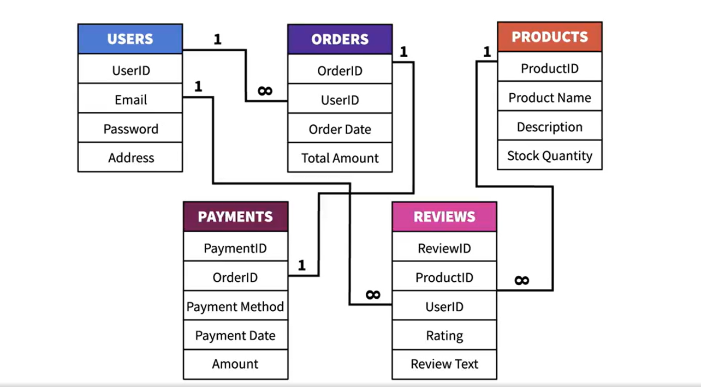

# 🛒 SQL Database Design and Optimisation Project

This project focuses on designing, optimizing, and populating a relational database for an e-commerce application. It follows best practices in database normalization, data cleaning, and ETL (Extract, Transform, Load) processes using MySQL and Python (via Jupyter Notebook).

---

## 📐 Entity-Relationship Diagram (ERD)
> A detailed ERD illustrates relationships between the key entities: Products, Users, Orders, Payments, and Reviews.

---

## 🧱 Database Design

### 🗂️ Tables Created
- **Users** 
- **Products** 
- **Orders**
- **Payments**
- **Reviews**

### 🔄 Normalization
The database was normalized up to **3NF**

---

## ⚙️ ETL Pipeline (Jupyter Notebook)

### 🔍 Extract
- Loaded datasets using `pandas` from `.csv` and `.xlsx` files.
- Established a database connection with `mysql.connector`.

### 🧹 Transform
- **Missing Values:** Filled with sensible defaults (e.g., "No description available").
- **Data Cleaning:** Replaced invalid emails with generated placeholders.
- **Data Types:** Enforced numerics for price/stock and standardized date formats.
- **Standardization:** Unified date formats as `YYYY-MM-DD`.

### 🚚 Load
- Truncated target MySQL tables to prevent duplication.
- Inserted cleaned records using `cursor.execute`.
- Ensured foreign key consistency by mapping legacy IDs to new ones.
- Filtered out reviews with missing or invalid data.

---

## ✅ Data Verification and Integrity Summary

This section outlines key SQL-based data verification and constraint-enforcement procedures applied to the e-commerce database.

### 🔍 1. Missing Data Checks
- Checked for `NULL` values in critical fields like `ProductName`, `Price`, and `StockQuantity` in the `Products` table.
- Verified `Users` table for missing `Email` and `UserName`.

### 📧 2. Email Format Validation
- Used pattern matching to detect invalid or malformed email addresses.

### 📆 3. Date Validation
- Validated `OrderDate` entries to ensure they fall within a realistic range (e.g., not before the year 2000 or after the current date).

### 🧑‍🤝‍🧑 4. Duplicate Detection
- Checked for duplicate `UserID` values using `GROUP BY` and `HAVING COUNT(*) > 1`.
- Provided optional deletion logic for duplicate rows.

### 🧱 5. Enforcing Schema Constraints
- Added a `CHECK` constraint to prevent negative prices in the `Products` table.
- Enforced basic email format rules at the schema level in the `Users` table.

### 🔗 6. Cascading Deletes
- Established a `FOREIGN KEY` with `ON DELETE CASCADE` to ensure that deleting a user also removes their associated orders.

### 🔒 7. Transactional Control
- Used `START TRANSACTION`, `COMMIT`, and `ROLLBACK` for safely handling multi-step operations like order placement and stock updates.

---

These checks collectively ensure a high-integrity, production-ready data foundation that supports robust analytics and reporting.

---

## 📊 Data Analysis & Reporting

With the database cleaned and verified, it's now ready for insights such as:
- Customer purchasing behavior
- Product demand trends
- Review distributions and sentiment
- Payment method analysis

---

## 🚀 Tech Stack

| Tool/Language     | Purpose                           |
|------------------|------------------------------------|
| MySQL             | Database storage and querying      |
| Python (pandas)   | ETL scripting and data wrangling   |
| Jupyter Notebook  | Interactive development environment|

---

